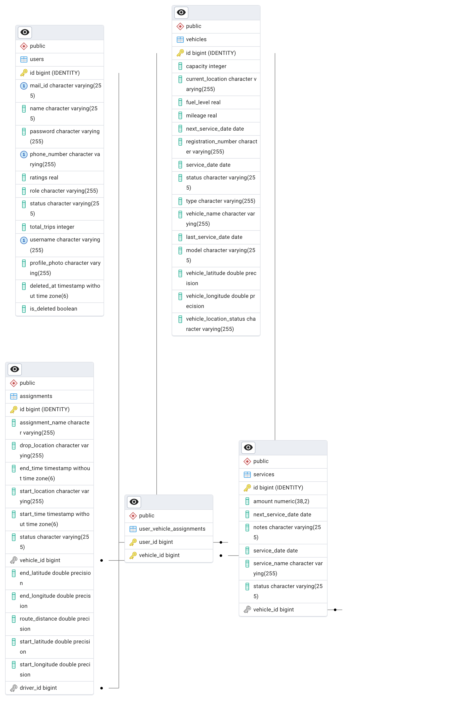
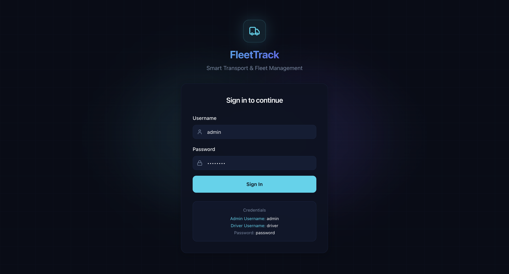
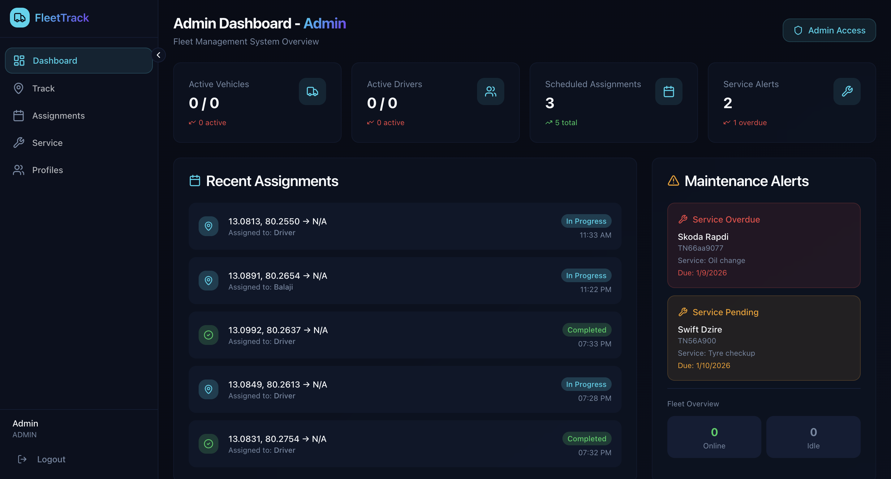
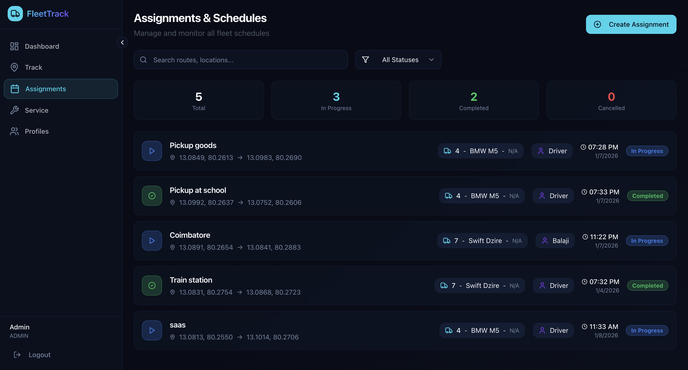
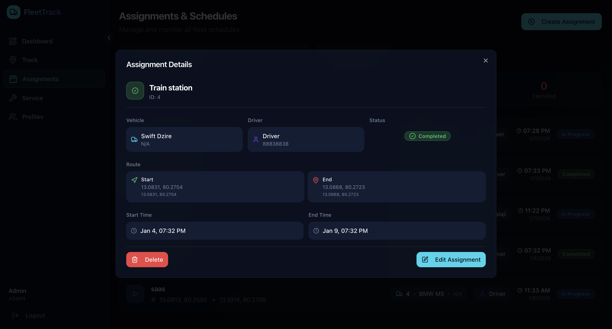
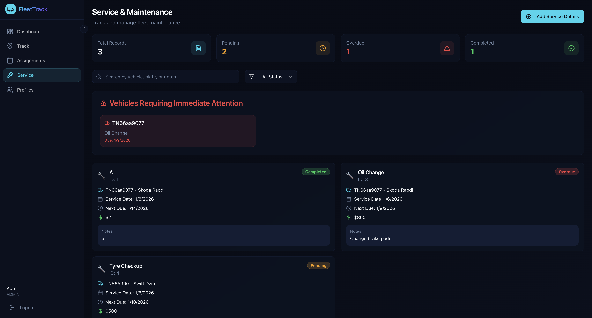
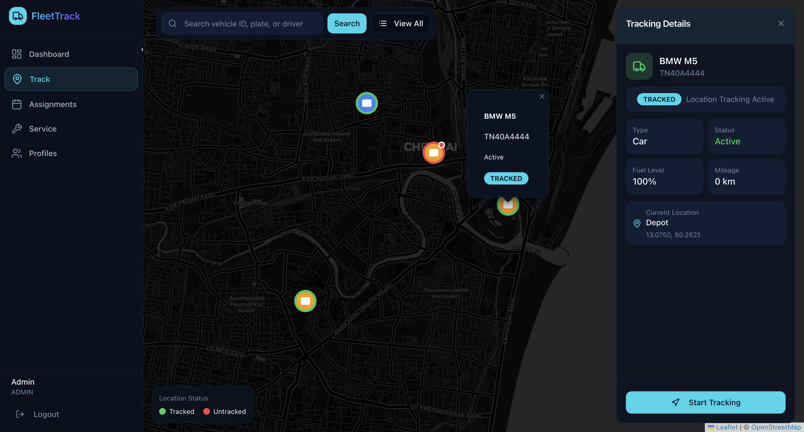
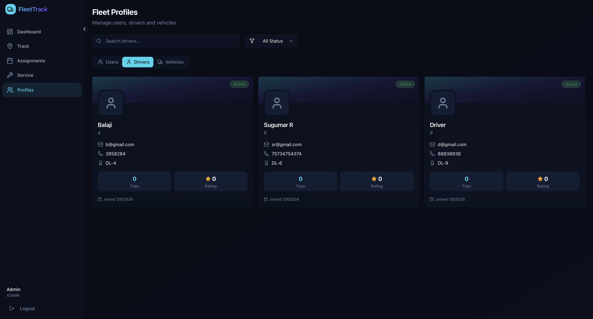
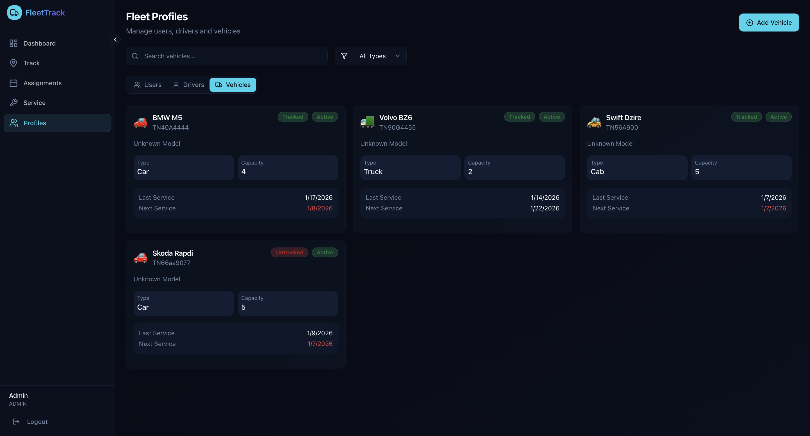

# 🚙 Smart Transport & Fleet Tracking Dashboard

Fleet Track is a full-stack fleet management system designed for transport businesses to manage drivers, vehicles, route assignments, and live tracking. The platform enables admins to assign tasks, monitor vehicle locations, manage vehicle services, and optimize operational workflows in real-time.


## Demo

https://fleet-track-lake.vercel.app


## 👉🏼 Features of the project 

- Live location tracking (Kafka + Redis + GPS/GPRS)
- Route visualization via map
- Assignment monitoring & progress tracking
- Generate vehicle service reminders
- Schedule routes & allocations
- View driver profiles & service history

## 🔒 Authentication & Security

- JWT authentication
- BCrypt encoded passwords
- CSRF protection
- Role-based access (Admin/Driver)
- Spring Security filters

## 🌐 DevOps & Deployment

- CI/CD deployment via Vercel & Render
- Docker containerized backend
- PostgreSQL cloud deployment
- Automatic redeploy on latest Git commits


## 🛠️ Tech Stack

**Frontend:** 
- React + TypeScript + Vite + Tailwind CSS 
- React Leaflet (Maps)

**Backend:** 
- Spring Boot
- Spring Security + JWT
- Spring Data JPA
- Redis (Live tracking)
- Kafka (Live event streaming)

**Database:** 
- PostgreSQL (Primary DB)

**DevOps & Tools:** 
- Vercel (Frontend hosting)
- Render (Backend & DB hosting)
- Docker (Containerization)
- GitHub (Version Control)


## 🗄️ Database Schema 

**Main Entities:** 
- User
- Vehicle
- Assignment
- Service

**ERP Diagram:**

Details Page

## 📁 Project Structure

**Frontend Structure :**

```bash
  .
├── App.css
├── App.tsx
├── api
│   └── api.ts
├── components
│   ├── NavLink.tsx
│   ├── layout
│       ├── AppSidebar.tsx
│       ├── DashboardLayout.tsx
│       └── Footer.tsx
├── contexts
│   └── AuthContext.tsx
├── hooks
│   ├── use-mobile.tsx
│   └── use-toast.ts
├── images
│   └── logo.png
├── index.css
├── lib
│   └── utils.ts
├── main.tsx
├── pages
│   ├── AssignmentsPage.tsx
│   ├── DashboardPage.tsx
│   ├── DriverProfilePage.tsx
│   ├── Index.tsx
│   ├── LoginPage.tsx
│   ├── NotFound.tsx
│   ├── ProfilesPage.tsx
│   ├── ServicePage.tsx
│   └── TrackPage.tsx
└── vite-env.d.ts

```
**Backend Structure :**

```bash
fleet_track
    ├── FleetTrackApplication.java
    ├── config
    │   └── SecurityConfig.java
    ├── controller
    │   ├── AssignmentController.java
    │   ├── AuthController.java
    │   ├── DashboardController.java
    │   ├── ProfileController.java
    │   ├── ServiceController.java
    │   ├── TrackController.java
    │   └── VehicleController.java
    ├── models
    │   ├── Assignment.java
    │   ├── Service.java
    │   ├── User.java
    │   └── Vehicle.java
    ├── repository
    │   ├── AssignmentRepository.java
    │   ├── ServiceRepository.java
    │   ├── UserRepository.java
    │   └── VehicleRepository.java
    ├── security
    │   ├── CustomUserDetailsService.java
    │   ├── JwtAuthenticationFilter.java
    │   └── JwtUtil.java
    └── service
        ├── AssignmentService.java
        ├── AuthService.java
        ├── ProfileService.java
        ├── ServiceService.java
        └── TrackService.java
```
## ⚙️ Installation & Setup

**Project Setup:**
```bash
git clone https://github.com/adhilogu/fleet_track.git
```

**Environment Variables:**
Create ```.env```

```bash
VITE_API_BASE_URL=http://localhost:8080/api
```

**Frontend Startup:**
```bash 
cd frontend/fleet-compass
npm install
npm run dev
```

**Backend Startup:**

Add DB Config in `application.properties:`
```bash
spring.datasource.url=jdbc:postgresql://localhost:5432/fleet
spring.datasource.username=postgres
spring.datasource.password=yourpassword
spring.jpa.hibernate.ddl-auto=update
spring.jpa.show-sql=true
```
*Run Application:*
```bash
cd backend
./mvnw spring-boot:run
```

## Screenshots


Login Page


Dashbaord Page


Assignments Page


Details Page


Service Page


Track Page


Driver Page


Vehicles Page


